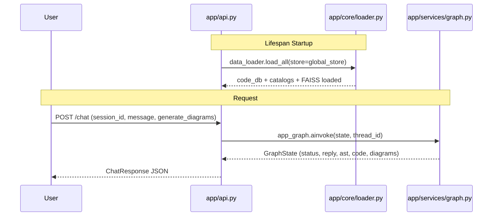
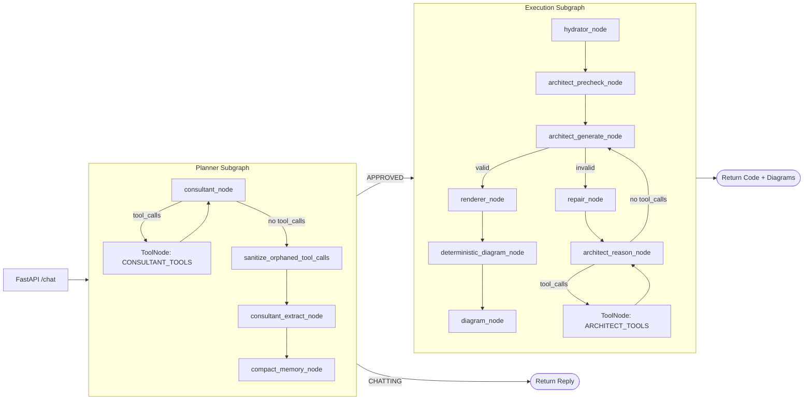
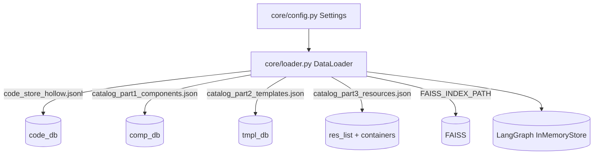
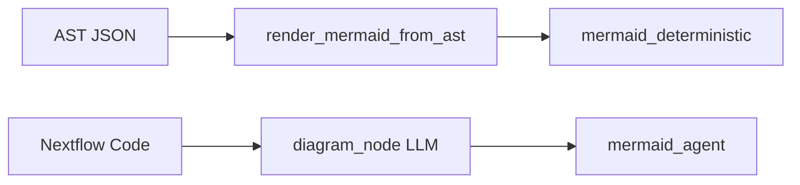

# Nextflow AI Agent API (izs-llm) - Comprehensive Documentation

Welcome to the IZS Nextflow AI Agent API (izs-llm). This repository hosts a FastAPI and LangGraph powered system that consults, plans, and generates Nextflow DSL2 pipelines, including deterministic and agentic Mermaid diagrams. This document is the per-folder, per-file guide for engineers and scientists continuing development.

---

## System Architecture

### End-to-End Request Flow

### Planner and Executor Graph

### Data Loading Flow

### Diagram Generation Paths

---

## Repository Index (Tests Ignored)

### Root Directory

| File / Folder      | Purpose / Description                                                                                |
| ------------------ | ---------------------------------------------------------------------------------------------------- |
| main.py            | Uvicorn entrypoint. Reads PORT and launches FastAPI app from app.api.                                |
| Dockerfile         | Container image definition. Python 3.12-slim with safe filesystem permissions and HF cache settings. |
| docker-compose.yml | Local orchestration. Runs api plus caddy reverse proxy.                                              |
| Caddyfile          | Caddy reverse-proxy configuration.                                                                   |
| requirements.txt   | Python dependencies (FastAPI, LangGraph, LangChain, FAISS, Pydantic, etc.).                          |
| langgraph.json     | Graph pointer for LangGraph Studio/CLI.                                                              |
| app/               | Core application and graph logic.                                                                    |
| data/              | Catalogs, code store, and FAISS index used for RAG and validation.                                   |
| scripts/           | Utility scripts (local usage).                                                                       |

---

## app/ Directory (Core Application)

### app/api.py

Defines the FastAPI app, request/response schemas, and HTTP endpoints.

Functions and Classes:

- ChatRequest: request model for /chat.
  - session_id, message, generate_diagrams.
- ChatResponse: response model for /chat.
  - status, reply, nextflow_code, mermaid_agent, mermaid_deterministic, ast_json, error.
- lifespan(app): startup hook; loads data_loader into global_store.
- health_check(): returns online status and vector store load status.
- chat_with_agent(request): invokes app_graph with thread_id and returns ChatResponse.

### app/core/config.py

Settings for paths, models, and tuning.

Key fields:

- BASE_DIR, DATA_DIR, FRAMEWORK_DIR (overridable by NGSMANAGER_DIR).
- FAISS_INDEX_PATH, CODE_STORE, CATALOG_COMPONENTS, CATALOG_TEMPLATES, CATALOG_RESOURCES.
- EMBEDDING_MODEL, LLM_MODEL.
- RAG thresholds and limits (keyword scan, FAISS k, L2 margins).
- Graph limits (MAX_TOOL_ITERATIONS, MAX_ARCHITECT_TOOL_ITERATIONS, MAX_REPAIR_RETRIES, MAX_DIAGRAM_RETRIES).
- Memory and truncation settings (MEMORY_KEEP_LAST_N, MAX_TOOL_RESULT_PREVIEW, MAX_CODE_DISPLAY_LENGTH).

### app/core/loader.py

DataLoader singleton that hydrates catalog data and FAISS index.

Functions:

- load_all(store=None): loads lookups and vector store, prints progress.
- \_load_lookups(store=None): loads code_db, comp_db, tmpl_db, res_list, containers_list and mirrors into store if provided.
- \_build_usage_index(store): builds reverse index component_id -> templates with usage snippets.
- \_extract_usage_snippet(template_code, component_id): extracts call-site context for a component.
- \_load_vector_store(): initializes HuggingFaceEmbeddings and loads FAISS.

---

## app/models/ Directory (Guardrails)

### app/models/consultant_structure.py

ConsultantOutput schema for the planner.

Functions and Validators:

- ConsultantOutput: response_to_user, status, draft_plan, strategy_selector, used_template_id, selected_module_ids.
- prevent_null_list: normalizes null lists to empty lists.

### app/models/diagram_structure.py

DiagramData schema for agentic diagrams.

Functions and Validators:

- Node: id, label, shape, subgraph.
  - validate_id, sanitize_label, validate_subgraph.
- Edge: source, target, label.
  - sanitize_edge_label.
- DiagramData: nodes, edges.
  - validate_graph_integrity.

### app/models/ast_structure.py

Nextflow AST schema and strict validators.

Core classes:

- ImportItem, GlobalDef, InlineProcess, WorkflowBlock, Entrypoint, NextflowPipelineAST.

Helper functions:

- \_is_void_tool(name): detects void tools by suffix or exact name.
- \_is_void_reference(text): detects references to void tools in emits.

Key validators:

- ImportItem: validate_aliases, forbid_nf_core, auto_fix_module_paths.
- GlobalDef: forbid_active_channels.
- InlineProcess: validate_no_dsl, validate_name.
- WorkflowBlock: rescue_and_heal_body, validate_emit_format, validate_emit_identifiers, forbid_void_emits,
  enforce_take_channel_usage, forbid_recursion, enforce_strict_data_shaping, enforce_variable_existence,
  enforce_host_depletion_shape, forbid_set_on_processes, enforce_reference_slice, forbid_void_tool_assignment,
  forbid_active_channels_in_subworkflows.
- Entrypoint: auto_heal_entrypoint.
- NextflowPipelineAST: auto_relocate_active_globals, auto_generate_imports,
  enforce_framework_components, enforce_workflow_usage.

---

## app/services/ Directory (Agents, Tools, Graph Wiring)

### app/services/graph_state.py

GraphState TypedDict with all fields exchanged across nodes.

Key fields:

- Planner state: consultant_status, design_plan, tool_memory, tool_call_count.
- Routing state: strategy_selector, used_template_id, selected_module_ids, technical_context.
- Executor outputs: ast_json, nextflow_code, mermaid_agent, mermaid_deterministic.
- Errors: error, validation_error, retries.
- messages: uses add_messages reducer.

### app/services/graph.py

Graph wiring for planner and executor.

Functions:

- sanitize_orphaned_tool_calls(state): injects stub ToolMessages for orphaned tool calls.
- check_consultant_status(state): returns approved or chatting.
- check_diagram_generation(state): decides diagram branch.
- compact_memory_node(state): extracts tool facts and trims tool loop history.
- build_consultant_subgraph(): tool loop, sanitize, extract, compact.
- build_execution_subgraph(): hydrator, precheck, generate, repair loop, render, diagrams.
- build_graph(): combines subgraphs with InMemorySaver and InMemoryStore.
- route_consultant(state): internal router for tool iteration caps and approval gating.
- route_architect_reason(state): internal router for architect tool iterations.

### app/services/agents.py

Node implementations for planner and executor.

Support functions:

- \_sanitize_messages_for_api(messages): ensures tool_call / tool_result parity, removes stale architect tool calls.
- filter_template_logic(code, allowed_components): comments out template steps not in plan.

Planner nodes:

- consultant_node(state, store): uses tool-bound LLM, prompts from prompt_loader, sanitizes history.
- consultant_extract_node(state, store): extracts ConsultantOutput, validates IDs via store, updates state.

Executor nodes:

- hydrator_node(state, store): assembles technical_context from template/code store and usage snippets.
- architect_precheck_node(state, store): deterministic channel checks and void tool warnings.
- architect_reason_node(state, store): tool-assisted reasoning for repair attempts.
- architect_generate_node(state): structured output to NextflowPipelineAST with error recovery.
- deterministic_diagram_node(state): AST -> Mermaid via render_mermaid_from_ast.
- diagram_node(state): LLM Mermaid graph from Nextflow code with retry loop.

### app/services/consultant_tools.py

Tools for planning and ID verification.

Tools:

- verify_component_id(component_id): validates IDs and returns metadata.
- search_components(query): hybrid keyword + FAISS search.
- get_template_logic(template_id): returns template metadata and code snippet.
- get_component_code(component_id): returns component metadata and code snippet.
- check_channel_compatibility(source_component_id, target_component_id): compares emit/take channels with fuzzy matching.
- check_plan_logic(component_ids, template_id): validates IDs, channel flow, and template coverage.
- find_component_usage(component_id): reverse lookup to show usage snippets.

Helpers:

- \_parse_nextflow_channels(code): parse take/emit blocks.
- \_parse_include_statements(code): parse include { ... } from lines.

### app/services/architect_tools.py

Tools used in architect repair reasoning.

Tools:

- lookup_component_code(component_id): returns code and parsed take/emit channels.
- verify_channel_connection(source_id, target_id): checks channel compatibility.
- validate_body_code(code_snippet, workflow_name): deterministic validation of body_code.

### app/services/renderer.py

Code rendering and deterministic diagrams.

Functions:

- render_nextflow_code(ast): renders AST using Jinja2 template.
- renderer_node(state): outputs nextflow_code, warns on persistent validation errors.
- render_mermaid_from_json(data): Mermaid rendering from DiagramData.
- render_mermaid_from_ast(ast_json): deterministic Mermaid rendering from AST.

### app/services/repair.py

Repair loop control.

Functions:

- repair_node(state): injects repair instruction with validation error.
- should_repair(state): routes to repair or fail based on retries.

### app/services/llm.py

LLM factory and rate limit helpers.

Functions:

- get_llm(): builds ChatMistralAI with settings and MISTRAL_API_KEY.
- get_judge_llm(temperature=0.0): ChatOpenAI for evaluation.
- rate_limit_pause(seconds=20): delay helper.
- with_rate_limit_retry(max_attempts=3, delay_seconds=25): retry decorator for 429 errors.

### app/services/prompt_loader.py

Prompt loading and caching.

Functions:

- \_escape_braces(text): escapes braces for prompt templates.
- \_load_file(path, escape=True): loads prompt files with optional escaping.
- load_tool_whitelist(): loads tool whitelist and formats it for prompts.
- load_consultant_prompt(): builds the consultant prompt.
- \_generate_tool_tables(): builds void tool list and emitting table from catalog.
- load_architect_prompt(): loads architect prompt and injects tables.
- load_diagram_prompt(): loads diagram prompt.
- reload_prompts(): clears caches.

### app/services/query_normalizer.py

Query normalization and intent detection.

Functions:

- normalize_query(user_query): replaces phrases, tokenizes, expands synonyms.
- is_discovery_query(clean_query): detects broad catalog exploration queries.
- build_semantic_query(clean_query, query_tokens): produces semantic search string.
- \_expand_tokens(base_tokens): adds stem and suffix variants.
- \_expand_synonyms(query_tokens): expands domain synonym sets.

### app/services/tools.py

Hybrid retrieval and context assembly.

Functions:

- retrieve_rag_context(user_query, store, embed_code=False): constructs context from catalogs, code store, resources, and FAISS.
- \_inject_component(comp_id, found_ids, context_blocks, store, embed_code=True): injects component metadata and code.
- \_inject_template(template_id, found_ids, context_blocks, store, embed_code=True): injects template metadata and code.

---

## app/utils/ Directory

### app/utils/rendering.py

Jinja2 template for rendering DSL2 output.

Key object:

- NF_TEMPLATE_AST: the template for imports, globals, inline processes, subworkflows, and entrypoint.

---

## data/ Directory (RAG Knowledge Base)

- faiss_index/: vector embeddings for semantic retrieval.
- code_store_hollow.jsonl: code store keyed by component/template IDs.
- catalog/:
  - catalog_part1_components.json: component metadata.
  - catalog_part2_templates.json: pipeline template metadata.
  - catalog_part3_resources.json: helper functions and containers.

---

## Usage Flow (Example)

1. User sends a message to /chat.
2. Planner runs: consultant_node -> tools loop -> consultant_extract_node.
3. If APPROVED, execution runs: hydrator -> precheck -> architect_generate -> render.
4. Diagrams are generated if generate_diagrams is true.
5. Response includes status, reply, code, and diagrams.
