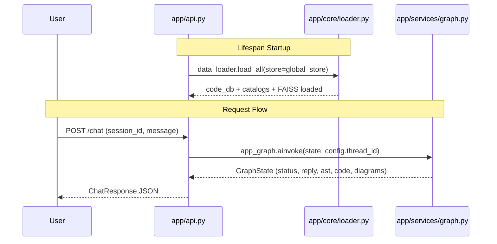
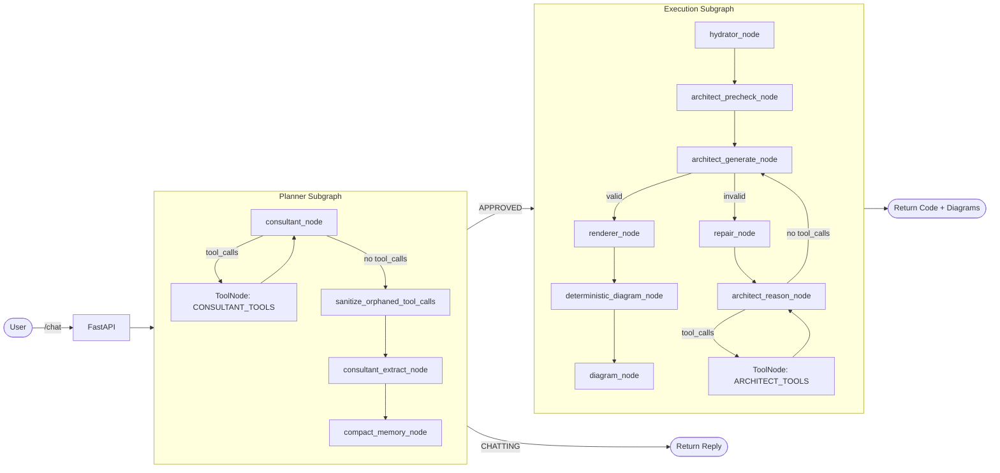
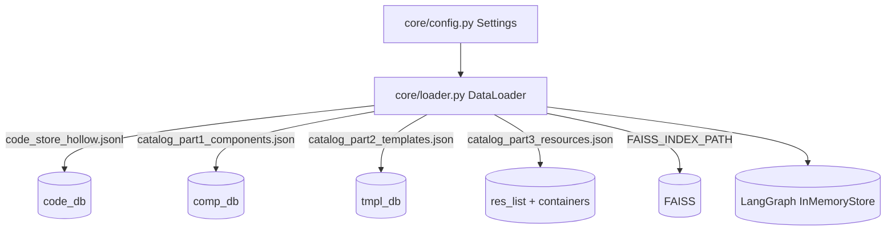
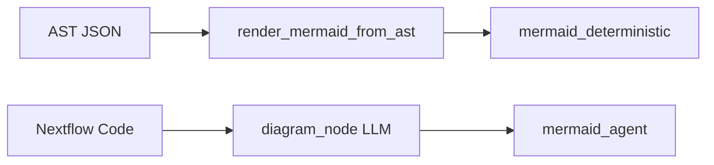

# app/ Directory - API and Graph Internals

This is the main application layer for the Nextflow AI Agent API. It hosts the FastAPI server, loads data stores, and orchestrates the LangGraph planner and executor pipelines that generate Nextflow DSL2 code and Mermaid diagrams.

## High Level Architecture

## Service Graph (Planner + Executor)

## Data Loading Flow

## Diagram Generation Paths

## Folder Map

- app/api.py: FastAPI app and HTTP endpoints.
- app/core/: Configuration and data loading.
- app/models/: Pydantic schemas and validators (AST and diagram guardrails).
- app/services/: LangGraph nodes, tool implementations, graph wiring.
- app/utils/: Jinja2 rendering template for Nextflow DSL2 output.

## app/api.py

### Data Models

- `ChatRequest`: request schema for `/chat`.
  - `session_id` identifies the LangGraph thread.
  - `message` is the user input.
  - `generate_diagrams` toggles diagram nodes.
- `ChatResponse`: response schema for `/chat`.
  - `status`, `reply`, `nextflow_code`, `mermaid_agent`, `mermaid_deterministic`, `ast_json`, `error`.

### Functions

- `lifespan(app)`: startup hook that calls `data_loader.load_all(store=global_store)`.
- `health_check()`: returns `online` plus vector store status.
- `chat_with_agent(request)`: builds graph input state, runs `app_graph.ainvoke`, extracts final AI reply, and maps outputs to `ChatResponse`.

## app/core/config.py

### Settings

- Paths: `BASE_DIR`, `DATA_DIR`, `FRAMEWORK_DIR` (override with `NGSMANAGER_DIR`).
- Data files: `FAISS_INDEX_PATH`, `CODE_STORE`, `CATALOG_COMPONENTS`, `CATALOG_TEMPLATES`, `CATALOG_RESOURCES`.
- Model settings: `EMBEDDING_MODEL`, `LLM_MODEL`.
- Retrieval tuning: `RAG_*` thresholds, counts, and margins.
- Limits: `MAX_TOOL_ITERATIONS`, `MAX_ARCHITECT_TOOL_ITERATIONS`, `MAX_REPAIR_RETRIES`, `MAX_DIAGRAM_RETRIES`.
- Memory windows: `MEMORY_KEEP_LAST_N`, `MEMORY_MAX_TOOL_FACTS`, context windows, truncation limits.

## app/core/loader.py

### DataLoader

- `load_all(store=None)`: loads catalogs, code store, and FAISS into memory.
- `_load_lookups(store=None)`: populates `code_db`, `comp_db`, `tmpl_db`, `res_list`, `containers_list`, and mirrors to store.
- `_build_usage_index(store)`: creates reverse index for component -> templates with usage snippets.
- `_extract_usage_snippet(template_code, component_id)`: extracts call-site context from a template.
- `_load_vector_store()`: initializes `HuggingFaceEmbeddings` and loads FAISS index with safe fallback on error.

## app/services/graph_state.py

### GraphState (TypedDict)

- Planner state: `consultant_status`, `design_plan`, `tool_memory`, `tool_call_count`.
- Hydrator routing: `strategy_selector`, `used_template_id`, `selected_module_ids`, `technical_context`.
- Executor outputs: `ast_json`, `nextflow_code`, `mermaid_agent`, `mermaid_deterministic`.
- Error fields: `error`, `validation_error`, `retries`.
- `messages` uses the `add_messages` reducer to manage message history.

## app/services/graph.py

### Functions

- `sanitize_orphaned_tool_calls(state)`: injects stub `ToolMessage` responses for tool calls without responses to satisfy provider constraints.
- `check_consultant_status(state)`: routes to executor only when status is `APPROVED`.
- `check_diagram_generation(state)`: toggles diagram nodes based on `generate_diagrams`.
- `compact_memory_node(state)`: extracts tool facts into `tool_memory` and removes older tool loop messages without losing content.
- `build_consultant_subgraph()`: planner loop with tools, sanitation, extraction, and compaction.
- `build_execution_subgraph()`: hydrator, precheck, generate, repair loop, render, and diagram nodes.
- `build_graph()`: combines planner and executor, sets entry point, adds InMemorySaver + InMemoryStore.
- `route_consultant(state)`: internal router in `build_consultant_subgraph` for tool loop limits and approval detection.
- `route_architect_reason(state)`: internal router in `build_execution_subgraph` for architect tool iterations.

## app/services/agents.py

### Support Functions

- `_sanitize_messages_for_api(messages)`: pairs tool calls with tool responses, drops stale architect tool calls.
- `filter_template_logic(code, allowed_components)`: comments out template steps not in the approved plan.

### Planner Nodes

- `consultant_node(state, store)`: tool-aware planner. Loads consultant prompt, binds tools, sanitizes history, and produces a new AI message.
- `consultant_extract_node(state, store)`: converts final consultant text into `ConsultantOutput`, validates IDs, and sets plan fields.

### Executor Nodes

- `hydrator_node(state, store)`: assembles `technical_context` with template code, component code, usage snippets, and helper function notes based on strategy.
- `architect_precheck_node(state, store)`: deterministic channel checks, void tool warnings, missing code warnings, and channel map notes.
- `architect_reason_node(state, store)`: tool-assisted reasoning when validation fails; provides investigation context for retries.
- `architect_generate_node(state)`: structured output to `NextflowPipelineAST`, with retry error capture and best-effort extraction.
- `deterministic_diagram_node(state)`: converts AST to Mermaid via `render_mermaid_from_ast`.
- `diagram_node(state)`: LLM-driven Mermaid generation from final Nextflow code, with retries.

## app/services/consultant_tools.py

### Core Tools

- `verify_component_id(component_id)`: validates component or template IDs and returns metadata.
- `search_components(query)`: hybrid keyword + FAISS search across catalogs.
- `get_template_logic(template_id)`: returns template metadata and code snippet.
- `get_component_code(component_id)`: returns component metadata and code snippet.
- `check_channel_compatibility(source_component_id, target_component_id)`: compares emit/take channels, includes fuzzy matching.
- `check_plan_logic(component_ids, template_id)`: validates IDs, connection flow, and template coverage.
- `find_component_usage(component_id)`: reverse lookup with usage snippets from templates.

### Helpers

- `_parse_nextflow_channels(code)`: parse `take:` and `emit:` blocks.
- `_parse_include_statements(code)`: parse `include { ... } from` lines.

## app/services/architect_tools.py

### Tools

- `lookup_component_code(component_id)`: returns code and parsed take/emit channels.
- `verify_channel_connection(source_id, target_id)`: compatibility check for emit vs take.
- `validate_body_code(code_snippet, workflow_name)`: deterministic checks for forbidden keywords, void tool assignment, join patterns, and unknown components.

## app/services/repair.py

### Functions

- `repair_node(state)`: injects a repair instruction message with the last validation error.
- `should_repair(state)`: routes based on `validation_error` and `MAX_REPAIR_RETRIES`.

## app/services/renderer.py

### Functions

- `render_nextflow_code(ast)`: renders AST into DSL2 via Jinja2, ensures missing keys do not crash rendering.
- `renderer_node(state)`: produces `nextflow_code` and a warning message if validation failures persisted.
- `render_mermaid_from_json(data)`: creates Mermaid flowchart from agentic `DiagramData`.
- `render_mermaid_from_ast(ast_json)`: deterministic Mermaid conversion from AST with stable IDs.

## app/services/llm.py

### Functions

- `get_llm()`: builds `ChatMistralAI` from `MISTRAL_API_KEY` and config settings.
- `get_judge_llm(temperature=0.0)`: `ChatOpenAI` for evaluation or judging.
- `rate_limit_pause(seconds=20)`: manual rate-limit delay helper.
- `with_rate_limit_retry(max_attempts=3, delay_seconds=25)`: decorator for retrying on 429 errors.

## app/services/prompt_loader.py

### Functions

- `_escape_braces(text)`: escapes braces for prompt templates.
- `_load_file(path, escape=True)`: read prompt files with optional escaping.
- `load_tool_whitelist()`: loads tool whitelist and formats it for the consultant prompt.
- `load_consultant_prompt()`: combines consultant base prompt and rejection rules.
- `_generate_tool_tables()`: creates void tool list and emitting tool table from catalog.
- `load_architect_prompt()`: loads architect prompt and injects tool tables.
- `load_diagram_prompt()`: loads diagram prompt.
- `reload_prompts()`: clears prompt caches.

## app/services/query_normalizer.py

### Functions

- `_expand_tokens(base_tokens)`: expands stems and suffix variants.
- `_expand_synonyms(query_tokens)`: expands domain-specific synonym sets.
- `normalize_query(user_query)`: lowercases, replaces bio phrases, and builds token set.
- `is_discovery_query(clean_query)`: identifies broad catalog exploration queries.
- `build_semantic_query(clean_query, query_tokens)`: removes filler terms and expands semantic search query.

## app/services/tools.py

### Retrieval Pipeline

- `retrieve_rag_context(user_query, store, embed_code=False)`: hybrid retrieval that builds a context block from catalog, code store, and FAISS.
  - Keyword scanning for templates and components.
  - Resource helper and container hints.
  - Semantic search with distance margins.

### Helpers

- `_inject_component(comp_id, found_ids, context_blocks, store, embed_code=True)`: appends component metadata and code.
- `_inject_template(template_id, found_ids, context_blocks, store, embed_code=True)`: appends template metadata and code.

## app/models/consultant_structure.py

### ConsultantOutput

- Enforces `status` gate (CHATTING vs APPROVED).
- Requires `draft_plan`, `strategy_selector`, `used_template_id`, and `selected_module_ids` only when APPROVED.
- `prevent_null_list` guards against null arrays.

## app/models/diagram_structure.py

### DiagramData

- `Node` and `Edge` schema validation for Mermaid safety.
- Enforces unique IDs and valid subgraph names.
- Sanitizes labels to avoid Mermaid parser failures.
- `Node` validators: `validate_id`, `sanitize_label`, `validate_subgraph`.
- `Edge` validator: `sanitize_edge_label`.
- `DiagramData` validator: `validate_graph_integrity`.

## app/models/ast_structure.py

### Core AST

- `ImportItem`, `GlobalDef`, `InlineProcess`, `WorkflowBlock`, `Entrypoint`, `NextflowPipelineAST`.
- Auto-healing of entrypoint and workflow bodies, void tool removal, and channel correctness.
- Enforcement of framework component existence based on the on-disk framework directory.

### Helper Functions

- `_is_void_tool(name)`: detects void tools by suffix or exact name.
- `_is_void_reference(text)`: detects references to void tool outputs.

### Key Validators (by class)

- `ImportItem`: `validate_aliases`, `forbid_nf_core`, `auto_fix_module_paths`.
- `GlobalDef`: `forbid_active_channels`.
- `InlineProcess`: `validate_no_dsl`, `validate_name`.
- `WorkflowBlock`: `rescue_and_heal_body`, `validate_emit_format`, `validate_emit_identifiers`, `forbid_void_emits`, `enforce_take_channel_usage`, `forbid_recursion`, `enforce_strict_data_shaping`, `enforce_variable_existence`, `enforce_host_depletion_shape`, `forbid_set_on_processes`, `enforce_reference_slice`, `forbid_void_tool_assignment`, `forbid_active_channels_in_subworkflows`.
- `Entrypoint`: `auto_heal_entrypoint`.
- `NextflowPipelineAST`: `auto_relocate_active_globals`, `auto_generate_imports`, `enforce_framework_components`, `enforce_workflow_usage`.

## app/utils/rendering.py

### Jinja2 Template

- `NF_TEMPLATE_AST`: single source of truth for DSL2 rendering.
- Formats imports, globals, inline processes, subworkflows, and entrypoint blocks.

## Notes for Maintainers

- The planner must always verify IDs using tools; do not rely on prompt memory.
- The executor is strict: validation errors are routed through repair loops and may still return best-effort drafts.
- The deterministic diagram is the stable reference; the agentic diagram is flexible but probabilistic.
