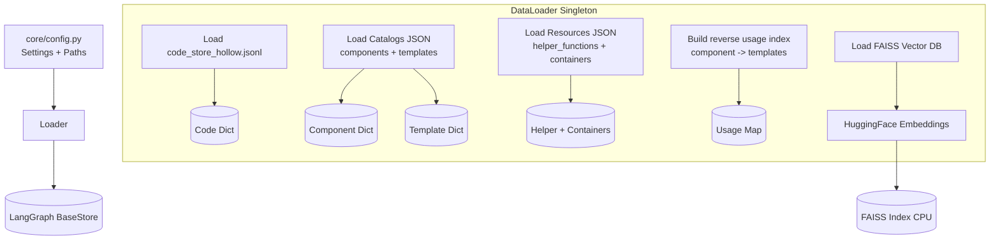

# `app/core/` Data Loading + Runtime Settings

This module initializes the backend data connections before any API requests are served. It defines all data paths, model selection, and retrieval tuning, then loads the catalogs, code stores, and FAISS index into memory. It also builds a reverse usage index so agents can see which templates use each component.

## Data Loading Flow

## Files & Responsibilities

### `config.py`

Centralized `Settings` class for all config and tuning constants.

**Paths**

- `BASE_DIR` and `DATA_DIR` are computed relative to this module to avoid brittle working-directory assumptions.
- `FRAMEWORK_DIR` can be overridden by `NGSMANAGER_DIR` and defaults to a sibling repo path for the framework tooling.
- File locations are defined for catalogs, the code store, and the FAISS index.

**Model Selection**

- `EMBEDDING_MODEL`: `Qwen/Qwen3-Embedding-0.6B`
- `LLM_MODEL`: `labs-devstral-small-2512`

**RAG Retrieval Tuning**

- Keyword scan limits, FAISS top-k, and L2 thresholds gate which catalog items are eligible for injection.
- Template filtering and relative margins prevent over-broad retrieval.

**Agent + Graph Limits**

- Iteration caps and retry limits for tool use, diagram generation, and repair loops.

**Context + Output Limits**

- Window sizes and truncation lengths for tool previews and code display.

### `loader.py`

Defines the `DataLoader` singleton and the runtime caches it hydrates.

**Public entrypoint**

- `load_all(store=None)` loads lookups and the vector store; if a LangGraph `BaseStore` is provided, it also hydrates it so agents can query via `store.get(...)` during graph traversal.

**Lookup loaders**

- `_load_lookups(store=None)` populates the in-memory dictionaries:
  - `code_db`: code snippets from `code_store_hollow.jsonl`
  - `comp_db`: components catalog
  - `tmpl_db`: templates catalog
  - `res_list`: helper function list
  - `containers_list`: container definitions
- When `store` is present, it mirrors each item into the store under:
  - `("code",)`, `("components",)`, `("templates",)`, and `("resources",)`

**Reverse usage index**

- `_build_usage_index(store)` constructs a component -> templates map by combining:
  - Catalog `steps_used` metadata
  - `include { ... } from` statements parsed from template code
- Each usage entry stores `template_id`, `template_description`, and a usage snippet.
- Usage data is written to the store under `("usage", component_id)`.

**Snippet extraction**

- `_extract_usage_snippet(template_code, component_id)` returns a few lines of context around the call site so agents can see how inputs and outputs are wired.

**Vector store loader**

- `_load_vector_store()` initializes `HuggingFaceEmbeddings` on CPU and loads the FAISS index from `FAISS_INDEX_PATH` with `allow_dangerous_deserialization=True`.
- Failures are caught and reported without crashing startup, allowing the API to continue with reduced capability.

## Runtime Data Structures

- `code_db`: `id -> content` from the code store file
- `comp_db`: `id -> component metadata`
- `tmpl_db`: `id -> template metadata`
- `res_list`: list of helper functions from the resources catalog
- `containers_list`: list of container definitions from the resources catalog
- `vector_store`: FAISS index for similarity search

## Store Keys (when `store` is provided)

- `("code",)` -> code content
- `("components",)` -> component metadata
- `("templates",)` -> template metadata
- `("resources",)` -> helper functions and containers lists
- `("usage", component_id)` -> templates that call a component
