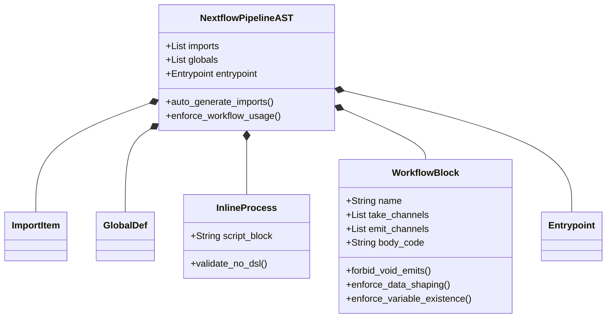
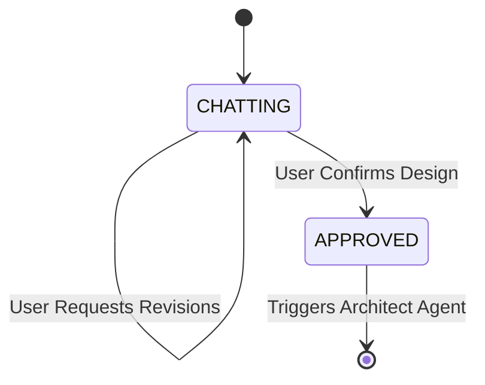

# `app/models/` Pydantic Guardrails

This directory contains strict **Pydantic Data Models**. It is the primary defense system against LLM hallucinations. Rather than asking an LLM to "write code", it forces the LLM to populate the objects below, allowing Python decorators to police the logic before it compiles.

## AST Class Architecture

## Defensive Modeling Files

### `ast_structure.py`
The most complex validation engine in the system. When the Architect Agent returns its pipeline suggestion, this file intercepts it and runs rigorous heuristic checks:
* **Validation Rules**: Uses `@field_validator` and `@model_validator` closures to parse the `body_code` using RegEx.
* **Self-Healing Triggers**: It detects if the LLM wrongly appends `.set` directly onto a process call (which is invalid in Groovy), or if it utilizes inline `.cross` statements without immediately flattening the tuple via `.map`. If it detects an error, it manually raises a `ValueError` injecting a highly-specific, scolding prompt instructing the LLM on exactly how to fix its own mistake.
* **Void Tool Blocking**: Specifically hardcodes rules preventing the LLM from trying to capture standard output channels from reporting/QC tools that utilize `publishDir` (Void tools).

### `consultant_structure.py`
Forces the Consultant Agent into its strict mode:

* Ensures `used_template_id` and `selected_module_ids` perfectly match strings retrieved from the RAG context.

### `diagram_structure.py`
Maps Nextflow logic to Mermaid `.js` elements:
* Validates Graph `Node` and `Edge` schemas, catching duplicate IDs or strings that utilize reserved terminology that would crash the Mermaid runtime engine.
