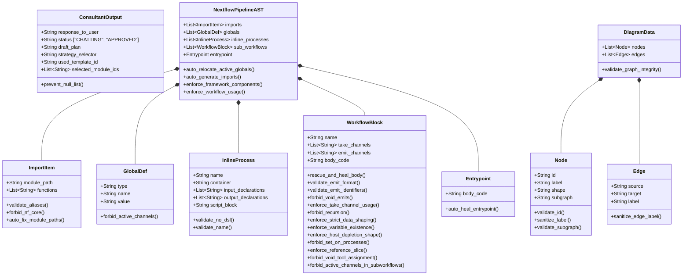

# `app/models/` Pydantic Guardrails

This directory contains strict **Pydantic Data Models**. It is the primary defense system against LLM hallucinations. Rather than asking an LLM to "write code", it forces the LLM to populate the objects below, allowing Python decorators to police the logic before it compiles.

## Comprehensive Data Model Architecture

The diagram below illustrates the hierarchical and interconnected nature of the Pydantic models across the architectural components, now updated to outline all individual deep validation methods deployed to ensure robust system operation.

## Defensive Modeling Files

### High-level flow

These models enforce a strict contract between LLM output and executable Nextflow DSL2. The LLM only fills JSON; Pydantic handles validation, auto-healing, and hard failures with explicit repair prompts.

### `ast_structure.py`

The core heuristic engine. When the Architect Agent returns its AST pipeline suggestion, this module intercepts the JSON tree and runs a gauntlet of strict `@field_validator` and `@model_validator` checks designed to police Nextflow DSL2 logic and the cohesive-ngsmanager framework constraints.

Key structural models:

- `ImportItem`: Validates import paths and aliases, forbids `nf-core`, and auto-fixes module paths based on tool prefix (`step_`, `multi_`, `module_`).
- `GlobalDef`: Blocks active channel creation in global scope and forces those calls into the entrypoint.
- `InlineProcess`: Forbids DSL2 logic inside shell scripts and disallows reserved tool prefixes / uppercase names.
- `WorkflowBlock`: Validates `take`, `emit`, channel shaping, recursion, void tool usage, and strict data-shaping rules.
- `Entrypoint`: Cleans wrappers and ensures the main workflow body is only raw logic.
- `NextflowPipelineAST`: Auto-relocates invalid globals, auto-generates imports, enforces framework component existence, and ensures sub-workflows are actually used.

* **Deterministic Auto-Healing Loop**: Rather than bothering the LLM for minor mistakes, the schema functions as a "silent healer", actively fixing the logic:
  - `rescue_and_heal_body`: Strips `dsl=2` headers, unwraps `workflow/take/main/emit` wrappers, extracts inline `emit:` assignments into `emit_channels`, removes void tool assignments, and removes void tool emits. Also injects `[1..3]` reference slices for mapping tools when required.
  - `auto_relocate_active_globals`: Detects active data channel calls (e.g., `getSingleInput()`) incorrectly placed in globals and relocates them into the entrypoint body.
  - `auto_fix_module_paths`: Adjusts import paths to match the tool prefix (e.g., `step_` -> `../steps`, `multi_` -> `../multi`).
  - `auto_heal_entrypoint`: Strips `dsl=2` headers and unwraps `workflow { }` wrappers, ensuring only raw logic remains.
* **Self-Correction Feedback Generation**: For fatal semantic violations that cannot be deterministically resolved, the schema raises detailed `ValueError` messages that guide the LLM to repair:
  - `enforce_strict_data_shaping`: Rejects inline `.cross()` / `.combine()` usage or un-flattened joins.
  - `forbid_active_channels_in_subworkflows`: Prevents `getInput*` / `getReference*` channel instantiation inside sub-workflows; those must live in the entrypoint.
  - `enforce_variable_existence`: Ensures emitted variables actually exist in the workflow scope.
  - `enforce_framework_components`: Rejects references to `step_`/`multi_`/`module_` tools that do not exist in the framework directory.
  - `forbid_void_tool_assignment` and `forbid_void_emits`: Guard against assigning or emitting tools that have no outputs.

### `consultant_structure.py`

Forces the Consultant Agent into its strict mode:

- Ensures `used_template_id` and `selected_module_ids` perfectly match strings retrieved from the RAG context.
- **Null Check Guards**: Incorporates the `prevent_null_list` `@field_validator` to safely catch and convert LLM anomalies where empty arrays evaluate as null, protecting data integrity prior to execution payload transmission.
- Restricts the agent to binary `status` decisions (`CHATTING` vs `APPROVED`).
- Requires the LLM to justify its pipeline strategy via `strategy_selector` (`EXACT_MATCH`, `ADAPTED_MATCH`, or `CUSTOM_BUILD`).
- Encodes explicit optionality: `draft_plan`, `strategy_selector`, and `used_template_id` are only required when `status` is `APPROVED`.

### `diagram_structure.py`

Maps Nextflow logic to Mermaid `.js` elements safely:

- Validates Graph `Node` and `Edge` schemas, catching duplicate IDs or strings that utilize reserved terminology that would crash the Mermaid runtime engine.
- Enforces `shape` typings mapping physical logic to visual markers (`input`, `process`, `operator`, `output`, `global`).
- Actively sanitizes labels to remove internal formatting quotes that break JavaScript rendering systems.
- Validates `subgraph` IDs to ensure they are Mermaid-safe and do not collide with reserved keywords.

## Quick Reference

### Primary contracts

- `ConsultantOutput` must be valid JSON with consistent status gating.
- `NextflowPipelineAST` must compile to a framework-valid DSL2 pipeline.
- `DiagramData` must serialize into safe Mermaid graph definitions.

### Framework integrity enforcement

- Component names are loaded from the framework filesystem at runtime.
- Any invalid component reference fails fast with best-guess suggestions.
- Import paths are automatically normalized to framework locations.
