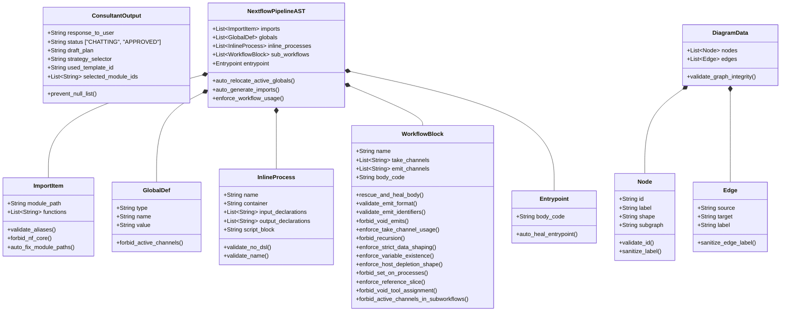

# `app/models/` Pydantic Guardrails

This directory contains strict **Pydantic Data Models**. It is the primary defense system against LLM hallucinations. Rather than asking an LLM to "write code", it forces the LLM to populate the objects below, allowing Python decorators to police the logic before it compiles.

## Comprehensive Data Model Architecture

The diagram below illustrates the hierarchical and interconnected nature of the Pydantic models across the architectural components, now updated to outline all individual deep validation methods deployed to ensure robust system operation.

## Defensive Modeling Files

### `ast_structure.py`
The absolute core heuristic engine inside the system. When the Architect Agent returns its AST pipeline suggestion, this file intercepts the JSON tree and runs a gauntlet of hyper-strict heuristic models utilizing over 15 targeted Pydantic `@field_validator` and `@model_validator` closures specifically engineered to police Nextflow DSL2 logic.

* **Deterministic Auto-Healing Loop**: Rather than bothering the LLM for minor mistakes, the schema functions as a "silent healer", actively fixing the logic:
  - `rescue_and_heal_body`: Deterministically strips illegal standard `dsl=2` headers, completely cleans assignments incorrectly made to `void` tool variables, and intelligently injects standard `[1..3]` reference index array slices for mapping tools if the LLM neglected them.
  - `auto_relocate_active_globals`: Detects if active data channels (e.g., `getSingleInput()`) were hallucinated directly into global/constants memory space, safely relocating them to the entrypoint scope automatically so Nextflow compilation doesn't immediately crash.
  - `auto_heal_entrypoint`: Automatically trims off unrequested external `workflow` JSON wrappers injected by the LLM. 
* **Self-Correction Feedback Generation**: For fatal semantic violations that cannot be deterministically resolved (like breaking pipeline execution rules), the schema leverages `ValueError` to raise massively detailed contextual error prompts directly back to the LLM agent, including instructions on how to solve the error:
  - `enforce_strict_data_shaping`: Intercepts attempts by the LLM to write inline `.cross()` stream assignments, forcefully raising an error prompting it to extract logic shapes downstream using `multiMap` flattening instead.
  - `forbid_active_channels_in_subworkflows`: Parses inner workflow steps manually scanning for `getInputOf` or other active channel extraction events. It raises a prompt forcing the LLM to migrate generation of those functional streams into the root execution orchestration layer (`entrypoint` string block) and pipeline them down via `take:` declarations.
  - `enforce_variable_existence`: Validates standard LHS emit streams to ensure the RHS internal process reference physically existed in the previously generated AST body.

### `consultant_structure.py`
Forces the Consultant Agent into its strict mode:
* Ensures `used_template_id` and `selected_module_ids` perfectly match strings retrieved from the RAG context.
* **Null Check Guards**: Incorporates the `prevent_null_list` `@field_validator` to safely catch and convert LLM anomalies where empty arrays evaluate as null, protecting data integrity prior to execution payload transmission.
* Restricts the agent to binary `status` decisions (`CHATTING` vs `APPROVED`).
* Requires the LLM to justify its pipeline strategy via `strategy_selector` (`EXACT_MATCH`, `ADAPTED_MATCH`, or `CUSTOM_BUILD`).

### `diagram_structure.py`
Maps Nextflow logic to Mermaid `.js` elements safely:
* Validates Graph `Node` and `Edge` schemas, catching duplicate IDs or strings that utilize reserved terminology that would crash the Mermaid runtime engine.
* Enforces `shape` typings mapping physical logic to visual markers (`input`, `process`, `operator`, `output`, `global`).
* Actively sanitizes labels to remove internal formatting quotes that break JavaScript rendering systems.
