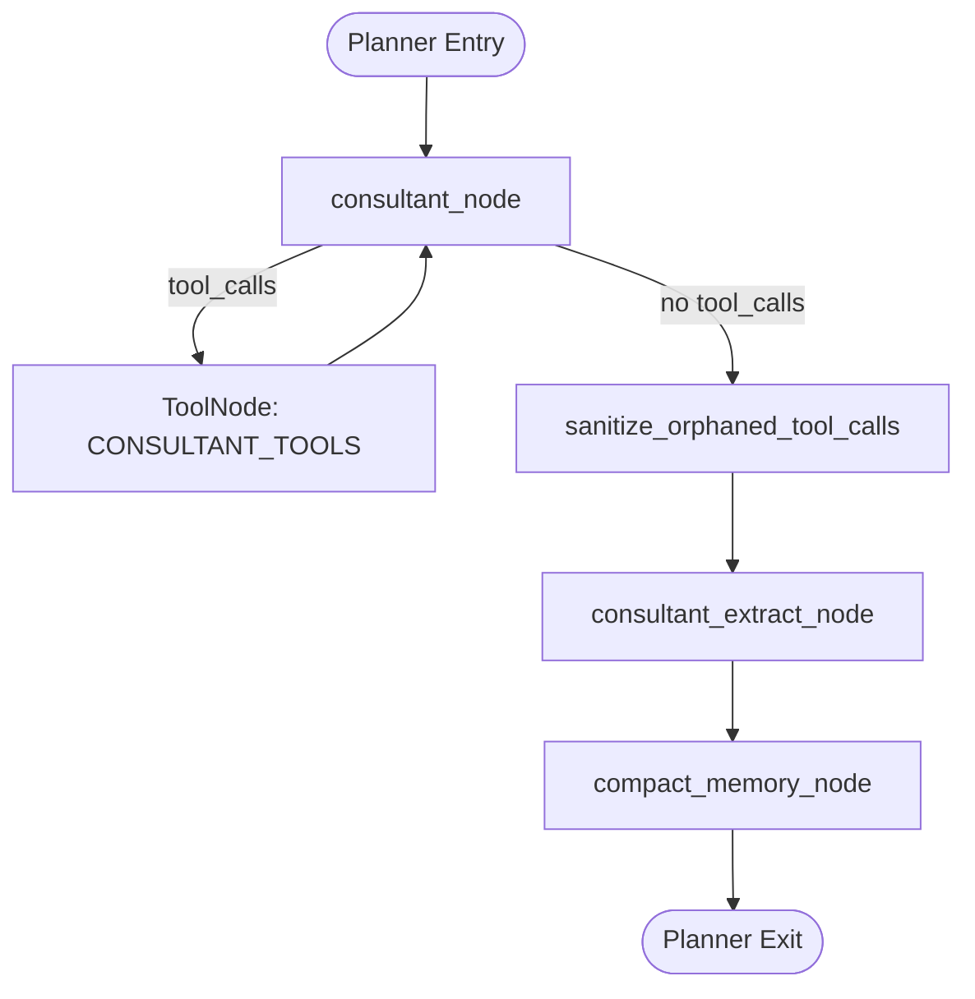
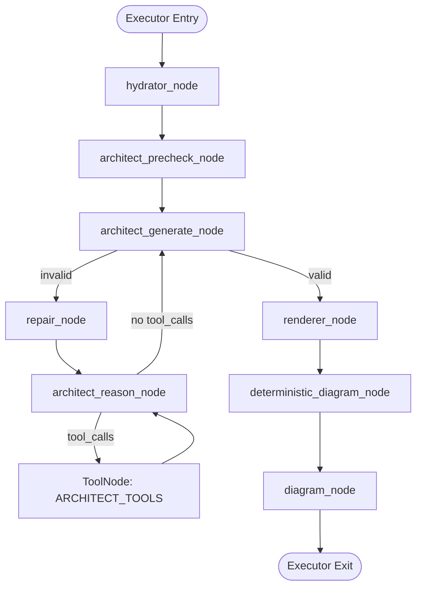
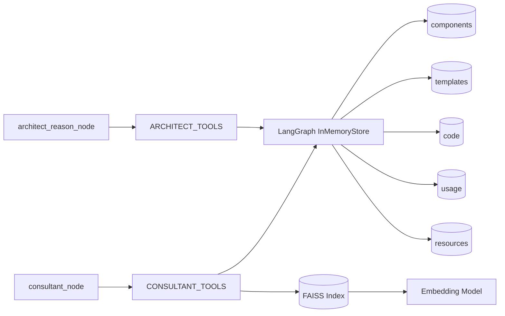
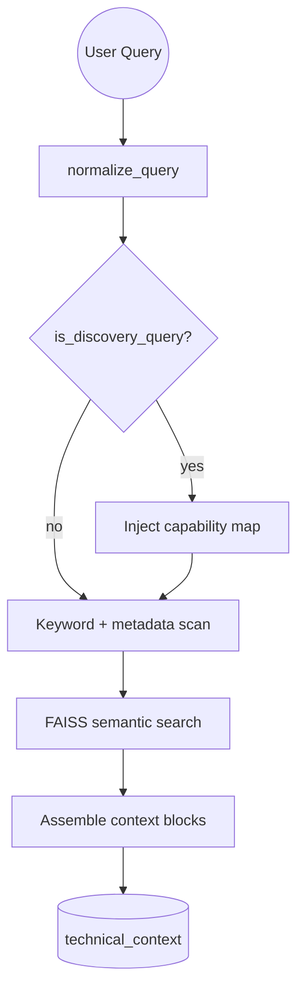

# app/services/ Core Artificial Intelligence

This directory is the orchestration layer for the multi-agent Nextflow DSL2 pipeline builder. It routes user requests through planner and executor subgraphs, enforces tool-grounded reasoning, generates validated ASTs, and renders both Nextflow code and Mermaid diagrams. The audience for this document is engineers and scientists extending the workflow logic, adding tools, or maintaining the graph.

## Service Type

LangGraph-based LLM orchestration service for planning, validating, and rendering Nextflow DSL2 pipelines.

## Primary Responsibilities

- Transform user intent into a structured, validated Nextflow AST.
- Enforce tool-grounded planning with strict ID verification and channel checks.
- Generate final artifacts: `nextflow_code`, deterministic Mermaid from AST, and agentic Mermaid from code.
- Protect against tool-call drift, message bloat, and schema violations using sanitization, memory compaction, and repair loops.

## Entry Points and Runtime Surface

- **Graph entry**: `app_graph` from [app/services/graph.py](app/services/graph.py) is compiled at import time and used by the API layer.
- **State contract**: `GraphState` in [app/services/graph_state.py](app/services/graph_state.py) defines all state keys and message reducer behavior.
- **Tooling**: consultant tools in [app/services/consultant_tools.py](app/services/consultant_tools.py) and architect tools in [app/services/architect_tools.py](app/services/architect_tools.py) are bound with `ToolNode`.

## Immediate Neighbors and Interfaces

- **Upstream**: FastAPI `/chat` endpoint calls `app_graph.ainvoke()` with `user_query`, `generate_diagrams`, and `messages`.
- **Downstream**: the executor produces `nextflow_code`, `mermaid_deterministic`, and `mermaid_agent` for the API layer.
- **Local stores**: LangGraph `InMemoryStore` holds catalog namespaces and code; FAISS powers semantic retrieval.
- **External services**: LLM provider for generation and diagram JSON; embeddings model for FAISS.

## High-Level Orchestration

```mermaid
flowchart LR
    subgraph Upstream[Upstream]
        API[FastAPI /chat]
    end

    subgraph Planner[Planner Subgraph]
        Consultant[consultant_node]
        Tools[ToolNode: CONSULTANT_TOOLS]
        Sanitize[sanitize_orphaned_tool_calls]
        Extract[consultant_extract_node]
        Compact[compact_memory_node]
    end

    subgraph Executor[Execution Subgraph]
        Hydrator[hydrator_node]
        Precheck[architect_precheck_node]
        Gen[architect_generate_node]
        Repair[repair_node]
        Reason[architect_reason_node]
        ArchTools[ToolNode: ARCHITECT_TOOLS]
        Render[renderer_node]
        DetDiag[deterministic_diagram_node]
        AgentDiag[diagram_node]
    end

    API -->|user_query, generate_diagrams, messages| Consultant
    Consultant -->|tool_calls| Tools
    Tools --> Consultant
    Consultant -->|no tool_calls| Sanitize --> Extract --> Compact
    Compact -->|status APPROVED| Hydrator

    Hydrator --> Precheck --> Gen
    Gen -->|valid| Render --> DetDiag --> AgentDiag
    Gen -->|invalid| Repair --> Reason
    Reason -->|tool_calls| ArchTools --> Reason
    Reason -->|no tool_calls| Gen
```



## Planner Subgraph: Detailed Flow



**Planner node responsibilities**

- `consultant_node`: tool-bound reasoning over user query and existing state. Generates tool calls or final text.
- `sanitize_orphaned_tool_calls`: injects stub ToolMessages when tool-call iteration caps skip unresolved calls.
- `consultant_extract_node`: converts the consultant final text into `ConsultantOutput`, verifies IDs, and updates `design_plan`.
- `compact_memory_node`: lossless compaction that extracts tool facts into `tool_memory` and prunes tool-loop messages.

## Executor Subgraph: Detailed Flow



**Executor node responsibilities**

- `hydrator_node`: assembles `technical_context` from templates, component code, and helper functions.
- `architect_precheck_node`: deterministic checks for channel mismatches, void tools, and missing code.
- `architect_generate_node`: generates `NextflowPipelineAST` using structured output with DSL2 constraints.
- `repair_node`: converts validation errors into a corrective prompt for a retry loop.
- `architect_reason_node`: uses architect tools to investigate failures before regeneration.
- `renderer_node`: renders Nextflow DSL2 via Jinja2 and emits warnings if validation did not resolve.
- `deterministic_diagram_node`: renders Mermaid from AST for stable diagrams.
- `diagram_node`: renders Mermaid from LLM-generated JSON derived from Nextflow code.

## Tool and Store Interaction Map



## Hybrid Retrieval Utility Flow

The following pipeline applies to the bulk context retrieval path in [app/services/tools.py](app/services/tools.py). This path is used outside of the tool-bound consultant loop and is retained for utility use cases.



## API Contracts (Immediate Neighbor: API Service)

The API surface is owned by the upstream FastAPI service. The services layer expects the following contract:

### `POST /chat`

**Request**

```json
{
  "session_id": "string",
  "message": "string",
  "generate_diagrams": true
}
```

**Response**

```json
{
  "status": "CHATTING|APPROVED|[ASSUMPTION]",
  "reply": "string",
  "nextflow_code": "string|null",
  "mermaid_agent": "string|null",
  "mermaid_deterministic": "string|null",
  "ast_json": {},
  "error": "string|null"
}
```

**Auth**

- No authentication is enforced in this service layer. Apply [ASSUMPTION] auth at the API gateway or middleware.

### `GET /health`

**Response**

```json
{
  "status": "online",
  "vector_store": "loaded|not_loaded"
}
```

## Data Dependencies

- Catalog JSON: component, template, and resource metadata used by tools and prompts.
- Code store JSONL: source code for components and templates used for channel checks and grounding.
- FAISS index: semantic retrieval store.
- InMemoryStore: transient state for tool memory, usage index, and catalog lookup.
- InMemorySaver: checkpointer used by LangGraph for thread state tracking.

## State Contract Summary

`GraphState` in [app/services/graph_state.py](app/services/graph_state.py) defines the state keys. Highlights:

- `user_query`, `generate_diagrams`, `messages` (with `add_messages` reducer).
- Planner state: `consultant_status`, `design_plan`, `tool_memory`, `strategy_selector`, `used_template_id`, `selected_module_ids`.
- Executor state: `technical_context`, `ast_json`, `nextflow_code`, `mermaid_deterministic`, `mermaid_agent`.
- Error state: `validation_error`, `error`, `retries`.

## Error Handling and Retry Strategy

- Tool-call drift is fixed by `sanitize_orphaned_tool_calls` when iteration caps force routing away from tools.
- Missing final consultant text is handled by synthesized summaries in `consultant_extract_node`.
- Validation failures trigger `repair_node` and a bounded retry loop controlled by `should_repair`.
- `renderer_node` outputs a warning banner in `nextflow_code` when retries are exhausted.
- Vector store failures are logged and skip semantic search rather than failing the graph.

## Scaling and Operational Notes

- CPU-bound for retrieval preprocessing and FAISS; scale horizontally with replicas.
- LLM calls dominate latency; apply [ASSUMPTION] rate limits and request budgeting.
- InMemoryStore is per-process; use sticky sessions or external storage if you need shared state across replicas.

## Function and Node Reference (by File)

### [app/services/graph.py](app/services/graph.py)

- `sanitize_orphaned_tool_calls`: injects stub ToolMessages for unmatched tool calls.
- `check_consultant_status`: routes planner exit based on `consultant_status`.
- `check_diagram_generation`: routes diagram creation based on `generate_diagrams`.
- `compact_memory_node`: lossless compaction of tool-loop messages into `tool_memory`.
- `build_consultant_subgraph`: defines planner nodes and tool loop routing.
- `build_execution_subgraph`: defines executor nodes, repair loop, and diagram routing.
- `build_graph`: compiles the full graph and initializes `InMemoryStore` and `InMemorySaver`.
- `app_graph`, `global_store`: compiled graph and store instance for runtime use.

### [app/services/graph_state.py](app/services/graph_state.py)

- `GraphState`: typed state contract including planner, executor, error, and message fields.

### [app/services/agents.py](app/services/agents.py)

- `consultant_node`: tool-bound planner LLM; returns tool calls or final text.
- `consultant_extract_node`: extracts structured `ConsultantOutput` from conversation and tool results.
- `architect_reason_node`: retry-only reasoning step that uses architect tools.
- `architect_generate_node`: generates `NextflowPipelineAST` via structured output.
- `diagram_node`: generates agentic Mermaid by translating Nextflow code to JSON graph data.
- `deterministic_diagram_node`: generates deterministic Mermaid from AST.
- `filter_template_logic`: strips template code to only allowed components for adapted mode.
- `hydrator_node`: assembles `technical_context` from templates, components, and helper functions.
- `architect_precheck_node`: deterministic channel and void-tool checks before generation.

### [app/services/consultant_tools.py](app/services/consultant_tools.py)

- `verify_component_id`: verifies a component or template ID exists and returns metadata.
- `search_components`: hybrid keyword plus semantic search with discovery mode handling.
- `get_template_logic`: returns template logic flow and source code snippet.
- `get_component_code`: returns component metadata and source code snippet.
- `check_channel_compatibility`: compares emit and take channels between two components.
- `check_plan_logic`: validates full plans, channel flow, and template coverage.
- `find_component_usage`: returns real usage snippets from templates.
- `_parse_nextflow_channels`: parses `take:` and `emit:` blocks from DSL2.
- `_parse_include_statements`: parses `include { ... } from` statements.
- `CONSULTANT_TOOLS`: tool registry for the planner ToolNode.

### [app/services/architect_tools.py](app/services/architect_tools.py)

- `lookup_component_code`: reads component or template code and parsed channels.
- `verify_channel_connection`: checks channel compatibility using code and metadata.
- `validate_body_code`: validates DSL2 body_code snippets for common errors.
- `ARCHITECT_TOOLS`: tool registry for the architect ToolNode.

### [app/services/renderer.py](app/services/renderer.py)

- `render_nextflow_code`: Jinja2 rendering with AST guardrails and whitespace cleanup.
- `renderer_node`: renders Nextflow code and injects warnings on failed validation.
- `render_mermaid_from_json`: renders Mermaid from agentic JSON diagram data.
- `render_mermaid_from_ast`: renders Mermaid deterministically from AST.

### [app/services/repair.py](app/services/repair.py)

- `repair_node`: builds a corrective prompt containing validation errors and schema rules.
- `should_repair`: routes repair loop based on retry count and validation state.

### [app/services/tools.py](app/services/tools.py)

- `_inject_component`: injects component metadata and optional code into context blocks.
- `_inject_template`: injects template metadata and optional code into context blocks.
- `retrieve_rag_context`: hybrid retrieval utility that builds a context payload.

### [app/services/llm.py](app/services/llm.py)

- `get_llm`: constructs the primary Mistral LLM client.
- `get_judge_llm`: constructs the evaluation LLM client.
- `rate_limit_pause`: blocking pause for rate-limit recovery.
- `with_rate_limit_retry`: decorator for retrying rate-limited LLM calls.

### [app/services/prompt_loader.py](app/services/prompt_loader.py)

- `_escape_braces`: escapes braces for prompt template safety.
- `_load_file`: loads prompt files with optional escaping.
- `load_tool_whitelist`: loads and formats the tool whitelist.
- `load_consultant_prompt`: assembles consultant base and rejection rules.
- `_generate_tool_tables`: builds void and emitting tool tables from catalog.
- `load_architect_prompt`: loads architect prompt with injected tables.
- `load_diagram_prompt`: loads the diagram prompt.
- `reload_prompts`: clears prompt caches.

### [app/services/query_normalizer.py](app/services/query_normalizer.py)

- `_expand_tokens`: adds morphological variants for query tokens.
- `_expand_synonyms`: expands bioinformatics synonyms.
- `normalize_query`: replaces aliases and builds token sets.
- `is_discovery_query`: detects broad catalog exploration intent.
- `build_semantic_query`: strips filler and builds a dense semantic query.

## Observability

- Startup logs: catalog load, FAISS load, LLM initialization.
- Runtime logs: tool errors, repair retries, render warnings, graph routing decisions.
- Tracing: no LangSmith or LangFuse callbacks are wired; add callbacks when constructing the LLM if needed.
