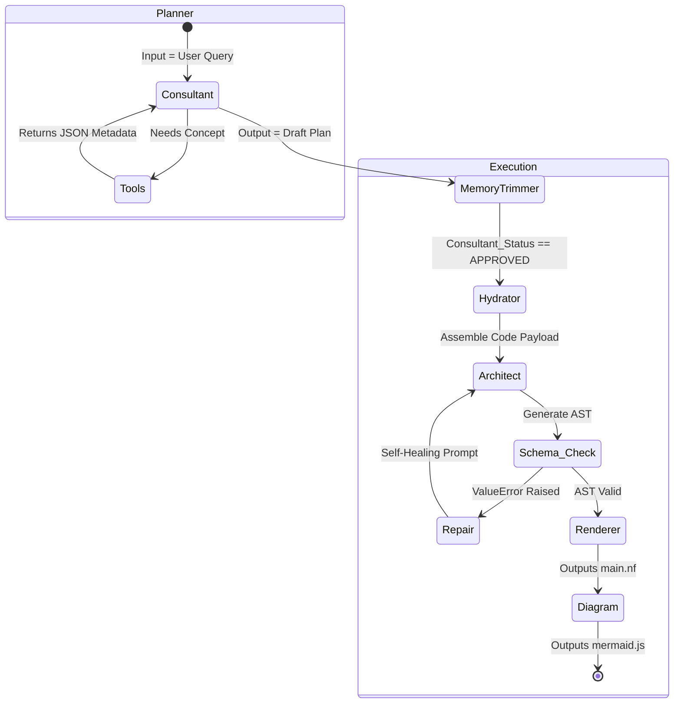
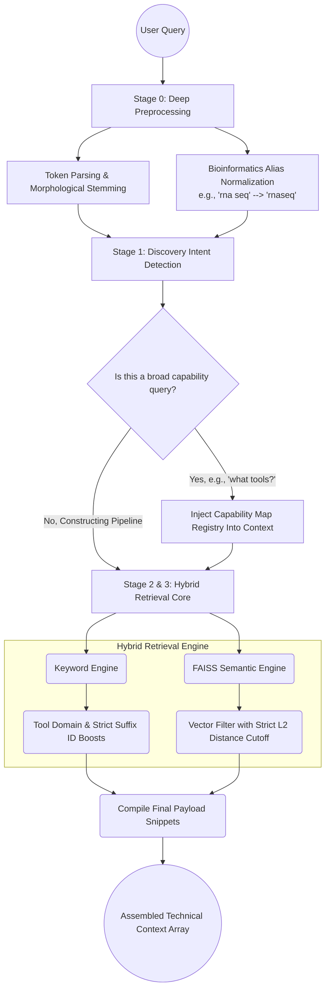

# `app/services/` Core Artificial Intelligence

The "Brains" of the application. This is where LangGraph orchestrates the various specialized agents to construct Nextflow pipelines. The agents communicate by modifying a shared state dictionary.

## Multi-Agent Logic Network

## System Implementation

### `graph.py` & `graph_state.py`
These files define the pipeline structure above.
* **`graph_state.py`**: Defines the massive `GraphState` typed dictionary holding conversation `messages`, `ast_json`, `mermaid_code`, `validation_error`, and more. Uses `Annotated[List[BaseMessage], add_messages]` to track conversation history.
* **`graph.py`**: Compiles the graph. Maps out the visual node workflow. Contains `build_consultant_subgraph()` (Planner Phase) and `build_execution_subgraph()` (Generation Phase), linking them conditionally based on the user's approval. Also implements the `delete_messages_node` to prune short-term conversation memory so the LLM doesn't hit a maximum context window limit.

### `agents.py`
Contains the continuously optimized and robust System Prompts dictating the system's strict DSL2 behavior:
* **`consultant_node`**: Interrogates the vector store. Output is actively cross-examined directly against the RAG store to verify `template_id`s and aggressively strip out hallucinated `module_ids` before returning to the planner graph, neutralizing false assumptions.
* **`hydrator_node`**: An algorithmic parser (non-LLM). Modifies string interpolation. It evaluates the Consultant's `strategy_selector` (`EXACT_MATCH`, `ADAPTED_MATCH`, or `CUSTOM_BUILD`). For an adapted match, it runs a regex script (`filter_template_logic`) identifying lines of the source `.nf` template that don't match the newly selected modules and structurally comments them out `// [REMOVED BY PLAN]`.
* **`architect_node`**: The heavy-lifting Node. It processes the Hydrator's assembled payload context alongside the Consultant's draft manual via a highly-tuned and extensively tested prompt matrix enforcing the Nextflow paradigm. It utilizes `with_structured_output` to build the strict logic mapping via AST JSON arrays.
* **`diagram_node`**: Receives the output `Nextflow` code from the Renderer, and compiles the text logic into a `DiagramData` mapping format for robust Mermaid rendering.

### `tools.py`
The intelligence center for the **Hybrid RAG Retrieval Engine**. The core logic within `retrieve_rag_context()` executes a highly sophisticated, multi-tier discovery pipeline that radically protects against LLM hallucinations and dramatically enhances relevance:

1. **Stage 0 — Deep Query Preprocessing & Normalization**: The initial query token parser filters irrelevant punctuation while aggressively scanning against massive localized hash-maps of complex bioinformatics synonym terms. It standardizes fragmented aliases (e.g., swapping out "long reads" -> "nanopore", "rna-seq" -> "rnaseq", "de novo" -> "denovo"). It then additionally runs a morphological stemmer over remaining query strings.
2. **Stage 1 — Discovery Intent Analysis**: Integrates regex detection to identify broad "discovery" terminology (e.g., "what pipelines do we have available", "tell me about your tools"). If detected, the algorithm bypasses specific targeted matches and completely dumps a dynamic `Capability Map Registry` representing the comprehensive grouping of all `Templates` and configured operational domains entirely into the LLM context path.
3. **Stage 2 — Metadata Keyword Sweeping**: Initiates heuristic scans over JSON components and templates inside the database. It implements a heavily weighted structural token-boosting algorithm (`structural_keywords`), where elements matching localized suffix criteria or exact `tool_names` are assigned 50+ score weights compared to generic I/O properties. Implements dynamic smart-threshold cutoffs (keeping results ≥20% of the top match) to instantaneously prune garbage context noise—pushing the inference models to strictly analyze the signal, not noise.
4. **Stage 3 — Latent Semantic FAISS Embedding Matching**: Performs broad similarity scans to grab relevant context not matched directly by keyword scoring. It filters conversational verbiage away (like "please help me build") via aggressive RegEx blocks, mapping dense numeral vectors exclusively onto the explicit scientific substance. Leverages rigid L2 Euclidean distance clustering thresholds—explicitly purging any tool component positioned outside a hard-coded vector deviation distance from the primary topological node.

### `repair.py`
The strict internal auto-healing feedback loop. If the `Architect Node` fails any constraint inside `ast_structure.py`, the `should_repair` condition intercepts it:
It wraps the Python error in the message `⚠️ CRITICAL: YOU ARE DRIFTING FROM THE SCHEMA... THE RULEBOOK... [ERROR MESSAGE]... GENERATE THE FULLY CORRECTED AST`. It will retry locally until solving it or failing entirely.

### `llm.py`
Factory pattern defining `get_llm()` to return the configured model instance (Groq, MistralAI, etc.).

### `renderer.py`
Takes the assembled logic and passes the JSON fields recursively into the `rendering.py` script. It cleans excess formatting whitespace and directly generates the raw executable string blocks.
